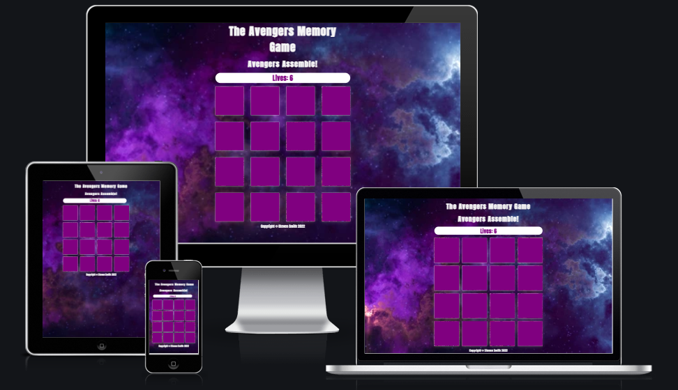
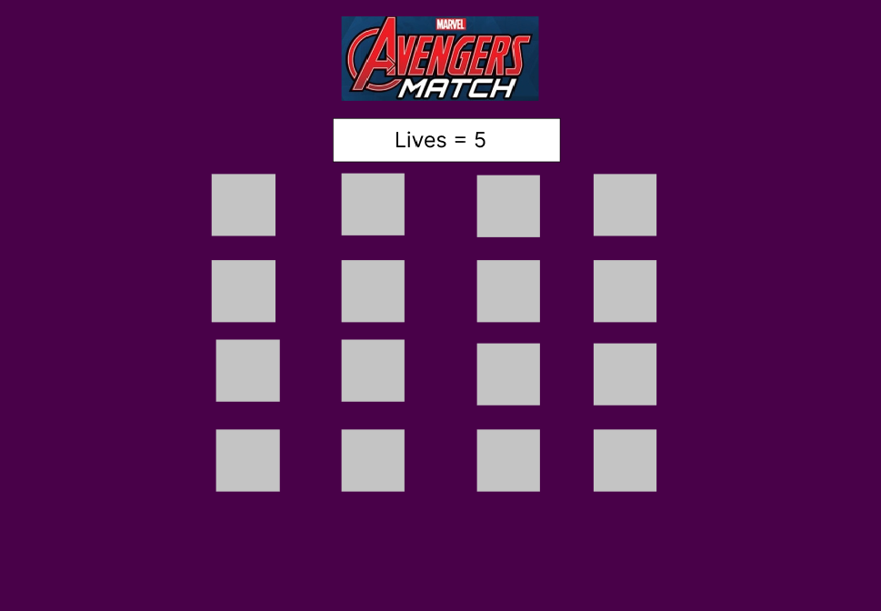
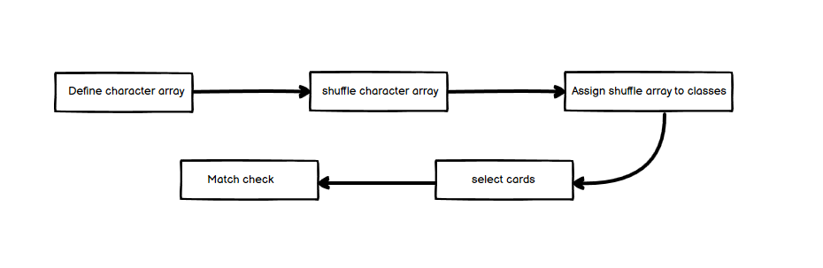
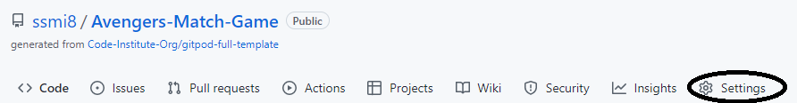
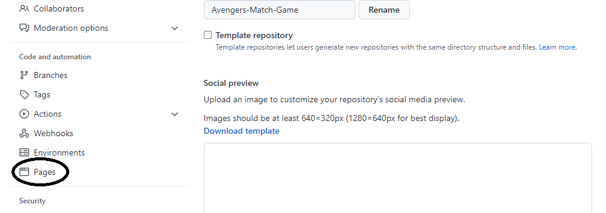
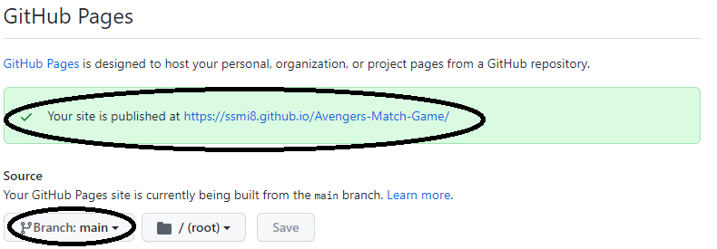

# Avengers Match Game

## Table of Contents

* [Introduction](https://github.com/ssmi8/Avengers-Match-Game/#introduction)
* [UX](https://github.com/ssmi8/Avengers-Match-Game/#ux)
   - [Development Cycle](https://github.com/ssmi8/Avengers-Match-Game/#development-cycle)
   - [Technologies Used](https://github.com/ssmi8/Avengers-Match-Game/#technologies-used)
* [Testing](https://github.com/ssmi8/Avengers-Match-Game/#testing)
   - [Errors](https://github.com/ssmi8/Avengers-Match-Game/#errors)
   - [Validating Testing](https://github.com/ssmi8/Avengers-Match-Game/#validating-testing)
   - [Chrome DevTools](https://github.com/ssmi8/Avengers-Match-Game/#chromedev-tools)
* [Deployment](https://github.com/ssmi8/Avengers-Match-Game/#deployment)
* [Future Improvements](https://github.com/ssmi8/Avengers-Match-Game/#future-improvements)
* [Credits](https://github.com/ssmi8/Avengers-Match-Game/#credits)
   - [Media](https://github.com/ssmi8/Avengers-Match-Game/#media)
   - [Reference Material](https://github.com/ssmi8/Avengers-Match-Game/#reference-material)

## Introduction

This project is a Marvel Avengers themed memory match game which incorporates themes from the Avengers End Game, but uses original comic pictures. The game was constructed with the intention of being a brain training tool to primarily strengthen memory. To differentiate from other memory match games an Avengers theme was incorporated to improve the users overall experience.

## UX
By visiting this site, as a user I would like: 

- to play a game to improve my congnitive function.
- to immediately understand what the game is and how it works.
- to enjoy and understand the theme of the game.
- to play a brain training game whilst having a fun experience.

The site was designed so that the user would land on the gaming page. This would allow the user to begin the game immediately and be able to test the memory.  The 

At design stage a initial colour scheme diagram was produced to indicate the Avengers End Game theme, which the user will recognise and be further enhances when playing the game and seeing the characters.  Originally, the designed incorporated the Avengers official logo, however the background did not match the theme, so was removed to enhance the user experience.

A wireframe was constructed using figma wireframes.

Initially used Figma to produce wireframes of how I wanted to the website to look. This enabled me to consider multiple layouts for the site before settling on a final design.

Landing Page

## Development Cycle

The game initially started out as an idea to develop my javascript skills. Once the prototype was completed, it's concept was used as groundwork to develop this project. One of the advantages gained by doing this was the ability to code the game faster since the main game code logic had already been mapped out.

The project development cycle main steps were as follows:

1. Game design work
2. Main game programming
3. Mid project review and testing
4. Trial and error for additional features
5. Final project review and testing
6. Final adjustments made

Functions for the main game were designed in the following order:

Full development cycle as per below:

1. Research Memory Games and decide on approach
2. Create Wireframes
3. Initial HTML, CSS and Javascript pages created
4. Logo and tag line added to html
5. footer added to html
6. images found, size adjusted and added to assets folder
7. create basic functions to pick up images in console
8. add images to html page in javascript
9. add flip function of the cards
10. flip only two cards and check logic if card matches
11. if match, card stays up facing, if not return back around
12. add randomising function
13. perform testing to make sure all running okay
14. Avengers theme backgrounded added
15. message deployment for win or loss
16. project review
17. modifications added for different size screens

## Technologies Used

- HTML5
- CSS
- Javascript
- Official W3C Validator for HTML
- CSS Official Validator (jigsaw)
- Chrome developer tools for debugging and testing
- Chrome developer tools for responsiveness
- Figma Wireframes tool

## Testing

This section provides details of testing performed during development. 

Testing was done as each change was saved.

- Within Gitpod I utilized the live server extension to see changes in real time.
- Using google developer tools I checked the responsiveness when changing screen sizing and used the desktop and mobile filters
- I used Chrome Developer tool to analyse and review what was going through the console with each change I made.
- Upon pushing the code to github I ran the lighthouse reports for mobile and desktop.
- Lastly I ran the code through validators to look for errors in html, css and javascript.
- For each update to git hub, I use industry standard commits as best practice.

## Errors

A number of errors came up during this project which I had to tackle and learn more about in order to correct these errors.  The following issues were identified and corrected:

1. The last card would not turn over if they user would win or lose the game.  This was rectified by insterting a setTimeout function which delayed the result() function so all cards were presented when winning the game, and the second selected card would show if the user lost.
2. Upon deployment of my website, the background image was not showing and wasn't being identified.  This was an error in my code where it was not selecting the correcr folder and therefore not showing in the live site.
3. While testing for reponsiveness using chrome dev tools it was noticed that the grid would hug the left hand side of the screen and on certain sizes overflow to the left, this was corrected by changing the size of the grid, as well as the font size of the titles.

### Validator Testing

* HTML
    - No errors but 1 warning was returned when passing through the W3C Validator.  This warning outlines a lack of a heading in the section where the game grid sits.
     [Report Here](https://validator.w3.org/nu/?doc=https%3A%2F%2Fssmi8.github.io%2FAvengers-Match-Game%2F)
* CSS
    - No errors were returned when passing through the W3C CSS Validation Service - Jigsaw. 
    [Report Here](https://jigsaw.w3.org/css-validator/validator?uri=https%3A%2F%2Fssmi8.github.io%2FAvengers-Match-Game%2F&profile=css3svg&usermedium=all&warning=1&vextwarning=&lang=en)
* JShint
    - There were warnings present when passing through the JShint site.

### ChromeDev Tools

Chrome DevTools were used extensively during development phase to assist in:

* debugging
* checking errors
* issues in page layout
* verifying correct output in the console

## Deployment

* My site was deployed via GitHub using the following steps:
    - GitHub repository, navigate to the settings tab.

    

    - Select the pages link in the setting menu.

    
    
    - Under the GitHub Pages from the source the section drop-down menu, select the master branch.
    
    

    - One the master branch has been selected, the page will be automatically refreshed with a detailed ribbon display to indicate the successful deployment.

The live link can be found here - [Avengers Memory Game](https://ssmi8.github.io/Avengers-Match-Game/)

## Future Improvements

Add difficulty levels to the the game to challenge users more and help improve their cognitive memory.  The user would specify the difficulty level and aim to beat their previous scores.

## Credits

### Media

* All my images were taken from the below

    - Pintrest website - [Pintrest](https://www.pintrest.co.uk)
    - Comics Alliance website - [Comics Alliance](https://www.comicsalliance.com)
    - Quora website - [Quora](https://www.quora.com)
    - Gamespot website - [Gamespot](https://www.comicvine.gamespot.com/)
    - Marvel website - [Marvel](https://www.marvel.com)

* The favicon was created by using [favicon-generator](https://www.favicon-generator.org/).  Using an image from the Marvel website, I was able to get the image file and tag code for the head of the HTML file.

### Reference Material

* I used W3 Schools as a reference point/tutorial for HTML, CSS and Javascript.
* I used CSS-Tricks for help on flexbox and other CSS styling.
* I used youtube video tutorials to help with some examples of functionality.

